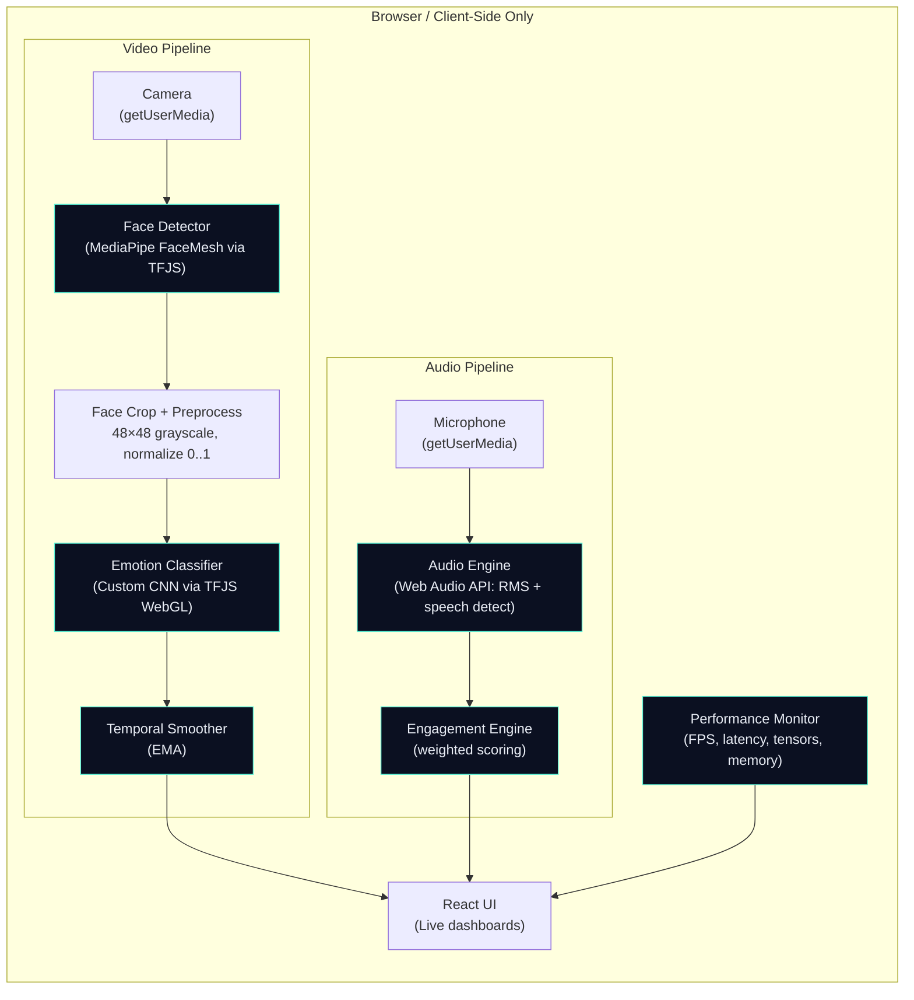

<div align="center">

# 🧠 EdgePresence

### Real-Time Emotion, Voice & Engagement Analysis — Entirely in the Browser

[](https://www.tensorflow.org/js)
[](https://astro.build)
[](https://react.dev)
[](https://www.typescriptlang.org)
[](LICENSE)

**No backend. No API calls. No data leaves your device.**  
Neural network–powered face detection, emotion classification, voice analysis, and engagement scoring — running 100% client-side via WebGL-accelerated TensorFlow.js.

---

[Features](#-features) · [Architecture](#-architecture) · [Quick Start](#-quick-start) · [How It Works](#-how-it-works) · [Model Training](#-model-training) · [Project Structure](#-project-structure) · [Tech Stack](#-tech-stack)

</div>

---

## ✨ Features

| Capability | How It Works | Runs On |
|:---|:---|:---|
| 🎭 **Face Detection** | MediaPipe FaceMesh (468 landmarks) via TensorFlow.js | WebGL 2 |
| 😊 **Emotion Classification** | Custom CNN trained on FER-2013 (7 emotions) | WebGL 2 |
| 🎙️ **Voice Analysis** | Web Audio API — RMS energy + speech detection | AudioContext |
| 📊 **Engagement Scoring** | Weighted fusion: emotion 40% + voice 30% + speech 30% | CPU |
| 🔒 **100% Client-Side** | Zero backend, zero network calls — your data never leaves the browser | — |
| ⚡ **Real-Time** | `requestAnimationFrame` loop with temporal smoothing for stable output | — |
| 📈 **Live Performance Metrics** | FPS, inference latency, tensor count, memory usage | — |

### Detected Emotions

> **Angry** · **Disgust** · **Fear** · **Happy** · **Sad** · **Surprise** · **Neutral**

---

## 🏛️ Architecture



---

## 🚀 Quick Start

```bash
# 1. Clone the repository
git clone https://github.com/your-username/TensorflowJS-ReactivAI.git
cd TensorflowJS-ReactivAI

# 2. Install dependencies
npm install

# 3. Start the dev server
npm run dev
```

Open **http://localhost:4321/TensorflowJS-ReactivAI/** — grant camera and microphone access, and you're live.

### Commands

| Command | Action |
|:---|:---|
| `npm install` | Install dependencies |
| `npm run dev` | Start dev server at `localhost:4321` |
| `npm run build` | Production build → `./dist/` |
| `npm run preview` | Preview production build locally |
| `npm run test` | Run unit tests (Vitest) |

---

## 🔬 How It Works

### 1. Face Detection — MediaPipe FaceMesh

The app uses **MediaPipe FaceMesh** through TensorFlow.js to detect faces and extract 468 facial landmarks in real time. Each video frame is snapshot to an off-screen canvas and passed to the model, avoiding WebGL texture conflicts with React's DOM management.

```
Camera → HTMLVideoElement → Off-screen Canvas snapshot → FaceMesh model → 468 keypoints + bounding box
```

- Bounding box computed from keypoint extremes with 10% padding
- Single-face mode for performance
- ~20–40ms per detection on modern GPUs

### 2. Emotion Classification — Custom CNN

A dedicated convolutional neural network classifies the detected face region into one of **7 emotions**. The face is extracted, resized to **48×48 grayscale**, normalized to `[0, 1]`, and passed through the model.

**Model Architecture:**

```
Input (48×48×1)
    ├─ Conv2D(32, 3×3) → BatchNorm → Conv2D(32, 3×3) → BatchNorm → MaxPool → Dropout(0.25)
    ├─ Conv2D(64, 3×3) → BatchNorm → Conv2D(64, 3×3) → BatchNorm → MaxPool → Dropout(0.25)
    ├─ Conv2D(128, 3×3) → BatchNorm → Conv2D(128, 3×3) → BatchNorm → MaxPool → Dropout(0.25)
    ├─ Flatten → Dense(256) → BatchNorm → Dropout(0.5)
    ├─ Dense(128) → BatchNorm → Dropout(0.3)
    └─ Dense(7, softmax) → Probability distribution over 7 emotions
```

- **1.5M parameters** / ~5.7 MB in browser
- Trained on **FER-2013** (35,887 facial expression images)
- Augmented with flips, rotation, zoom, and translation
- Class-weighted loss to handle imbalanced classes (e.g., disgust has only 436 training samples)
- **Temporal smoothing** via exponential moving average eliminates jitter between frames

### 3. Voice Analysis — Web Audio API

Real-time audio analysis runs entirely in-browser using the **Web Audio API**:

```
Microphone → MediaStream → AudioContext → AnalyserNode → Float32 time-domain data → RMS Energy
```

- **RMS Energy**: root mean square of the waveform — measures volume/intensity
- **Speech Detection**: threshold-based binary classification (speaking vs. silent)
- **Speech Continuity**: rolling 30-frame window tracking ratio of speaking frames
- Echo cancellation, noise suppression, and auto-gain enabled at capture

### 4. Engagement Scoring — Multi-Signal Fusion

The engagement engine fuses all three signals into a **0–100 composite score**:

$$\text{Score} = \bigl(\underbrace{E_{\text{confidence}}}_{\text{Emotion}} \times 0.4\bigr) + \bigl(\underbrace{V_{\text{energy}}}_{\text{Voice}} \times 0.3\bigr) + \bigl(\underbrace{S_{\text{continuity}}}_{\text{Speech}} \times 0.3\bigr) \times 100$$

| Component | Weight | Signal Source |
|:---|:---|:---|
| Emotion Confidence | 40% | Softmax confidence from CNN |
| Voice Energy | 30% | Normalized RMS from microphone |
| Speech Continuity | 30% | Rolling speaking ratio (30-frame window) |

### 5. Performance Monitoring

A built-in performance monitor tracks:

- **FPS** — frames processed per second
- **Face Detection Latency** — ms per face detection call
- **Emotion Inference Latency** — ms per CNN forward pass
- **Tensor Count & Memory** — active WebGL tensors and allocated bytes (leak detection)

---

## 🏋️ Model Training

The emotion CNN is trained offline in Python and exported to TensorFlow.js format using a **custom pure-Python converter** (no `tensorflowjs` pip package required).

### Prerequisites

```bash
pip install -r scripts/requirements-python-training.txt
# → tensorflow==2.15.0, numpy==1.26.4, Pillow
```

### Train on FER-2013

```bash
# From image directory (recommended — Kaggle's pre-split format)
python scripts/train-emotion-model.py \
  --data-dir /path/to/fer2013 \
  --epochs 50 \
  --batch-size 64

# From CSV file
python scripts/train-emotion-model.py \
  --data /path/to/fer2013.csv \
  --epochs 50

# Quick pipeline test with synthetic data
python scripts/train-emotion-model.py --synthetic
```

The script automatically:

1. Loads and normalizes images (48×48 grayscale, `[0, 1]`)
2. Computes per-class weights (capped at 3×) for imbalanced classes
3. Trains with augmentation (flips, rotation, zoom, shift)
4. Saves Keras model to `artifacts/emotion_model.keras`
5. Converts to TensorFlow.js at `public/models/emotion_model/`

### Custom Keras → TFJS Converter

The standard `tensorflowjs` Python package is notoriously difficult to install. We built a **pure-Python converter** that produces identical output:

```bash
python scripts/convert_keras_to_tfjs.py \
  --keras artifacts/emotion_model.keras \
  --out public/models/emotion_model
```

It handles:
- Keras 3 → TFJS-compatible topology stripping (`module`, `registered_name`, `build_config`)
- Weight name sanitization (removes `:0` suffixes)
- Single-shard binary packing (`group1-shard1of1.bin`)

### A/B Testing Models

Switch models at runtime via URL parameter:

```
http://localhost:4321/TensorflowJS-ReactivAI/?model=emotion_model_py
```

---

## 📁 Project Structure

```
TensorflowJS-ReactivAI/
├── public/
│   └── models/
│       └── emotion_model/          # TFJS model files served as static assets
│           ├── model.json          #   Model topology + weights manifest
│           └── group1-shard1of1.bin #   Binary weight data (~5.7 MB)
│
├── src/
│   ├── pages/
│   │   ├── index.astro             # Main app page
│   │   └── debug.astro             # Face detection debugger
│   │
│   ├── components/
│   │   └── EmotionAnalyzer.tsx      # Main React component (camera, loop, UI)
│   │
│   ├── ml/                          # Machine learning modules
│   │   ├── tfSetup.ts              #   WebGL 2 backend initialization
│   │   ├── faceDetector.ts         #   MediaPipe FaceMesh wrapper
│   │   ├── emotionClassifier.ts    #   CNN model loading + inference
│   │   └── temporalSmoother.ts     #   EMA filter for stable predictions
│   │
│   ├── audio/
│   │   └── audioEngine.ts          # Web Audio API: RMS energy + speech detect
│   │
│   ├── scoring/
│   │   └── engagementEngine.ts     # Multi-signal engagement scoring
│   │
│   ├── monitoring/
│   │   └── performanceMonitor.ts   # FPS, latency, memory tracking
│   │
│   ├── utils/
│   │   ├── math.ts                 # Clamp, lerp, mean, std deviation
│   │   └── normalization.ts        # Pixel normalization, z-score, min-max
│   │
│   └── shims/                       # Browser shims for Node-only packages
│       ├── node-fetch.ts
│       └── whatwg-url.ts
│
├── scripts/                         # Offline training pipeline (Python)
│   ├── train-emotion-model.py      #   Full training script (FER-2013 / synthetic)
│   ├── convert_keras_to_tfjs.py    #   Pure-Python Keras → TFJS converter
│   ├── train-emotion-model.mjs     #   Legacy JS training pipeline
│   ├── test_model.py               #   Model diagnostic tests
│   ├── verify_conversion.py        #   Bit-level weight verification
│   └── requirements-python-training.txt
│
├── types/                           # TypeScript declarations
├── astro.config.mjs                # Astro config (static output, GitHub Pages)
├── tsconfig.json
├── vitest.config.ts
└── package.json
```

---

## 🛠️ Tech Stack

### Runtime (Browser)

| Technology | Role |
|:---|:---|
| **TensorFlow.js 4.22** | Neural network inference (WebGL 2 GPU-accelerated) |
| **MediaPipe FaceMesh** | 468-point facial landmark detection |
| **Web Audio API** | Real-time microphone RMS energy & speech detection |
| **WebRTC** | Camera access via `getUserMedia` |
| **React 19** | Reactive UI with real-time metric dashboards |
| **Astro 5.17** | Static site framework (zero JS overhead for shell) |
| **TypeScript 5.9** | Type safety across all modules |

### Training (Offline, Python)

| Technology | Role |
|:---|:---|
| **TensorFlow / Keras 2.15** | CNN architecture, training, and augmentation |
| **FER-2013 Dataset** | 35,887 labeled facial expression images |
| **Pillow** | Fast image I/O (grayscale conversion, resizing) |
| **Custom TFJS Converter** | Pure-Python Keras → TFJS export (no `tensorflowjs` dep) |
| **NumPy 1.26** | Numerical operations and data manipulation |

### Testing

| Technology | Role |
|:---|:---|
| **Vitest 4** | Unit tests for math, normalization, scoring, smoothing |

---

## 🔑 Key Design Decisions

### Why No Backend?

Privacy and portability. All neural network inference runs on the user's GPU via WebGL. Camera frames and microphone audio are processed locally — nothing is transmitted over the network. The entire app deploys as static files to GitHub Pages.

### Why a Custom TFJS Converter?

The official `tensorflowjs` Python package has heavy native dependencies and frequent installation failures. Our pure-Python converter (`convert_keras_to_tfjs.py`) produces **bit-identical** output using only `tensorflow` + `numpy` — verified by comparing all 22 weight tensors against the original Keras model.

### Why Temporal Smoothing?

Raw per-frame emotion predictions are noisy — a face might flicker between "Happy" and "Neutral" across consecutive frames. An **exponential moving average** (α = 0.3) stabilizes output while remaining responsive to genuine expression changes.

### Why Canvas Snapshot for Face Detection?

Passing `HTMLVideoElement` directly to `estimateFaces()` fails when the video is rendered inside React's component tree — WebGL's `texImage2D` cannot reliably read pixels from a video whose layout is managed by CSS transforms and positioned containers. Snapshotting to an off-screen canvas solves this reliably.

---

## 📄 License

This project is licensed under the **Apache License 2.0**. See [LICENSE](LICENSE).

---

<div align="center">

**Built with neural networks, Web APIs, and zero backend dependencies.**

*All AI inference happens on your device. Your data stays yours.*

</div>
